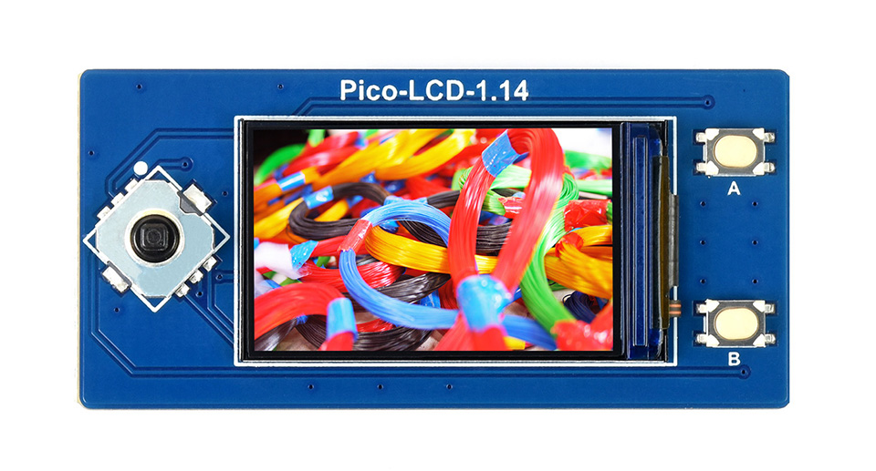
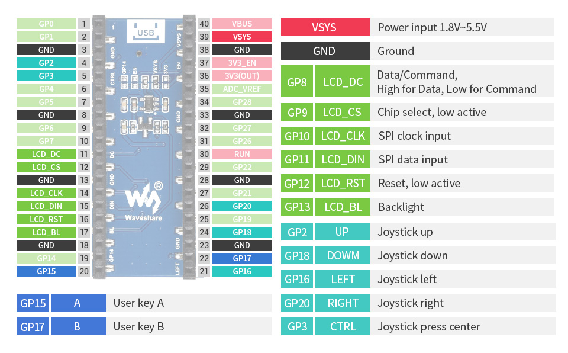

# Overview
A modern remake of my senior project from college. 

"Smoke & Hope" was my college project and was a competition shooting timer. It originally used:
* FPGA development board
  * I designed a soft-core processor and a custom DSP module in VHDL
  * Wrote the timing and graphics in C++
* Custom vibration sensor (for detecting the gun shot)
* Resistive touch screen

This project (also named after a classic competition shooting course) is a "re-take". I'm looking to:
* Modernize
* Miniaturize
* Make portable

## Features
* Built on the Raspberry Pi Pico
* 1.14 inch LCD display
* Custom PCB for the vibration sensor circuit
* Battery powered
* 3D printed case

## Resources
* [Raspberry Pi Pico](https://www.raspberrypi.org/products/raspberry-pi-pico/)
* [1.14 inch LCD display](https://www.pishop.us/product/1-14inch-lcd-display-module-for-raspberry-pi-pico-65k-colors-240-135-spi/)
* [Battery](https://www.pishop.us/product/lithium-ion-polymer-battery-3-7v-900mah/)

### Prerequisites
* [Docker](https://docs.docker.com/get-docker/)
* [Pico Probe](https://www.raspberrypi.org/documentation/rp2040/getting-started/#debug-probe)
* [Raspberry Pi Pico](https://www.raspberrypi.org/products/raspberry-pi-pico/)
* [CMake](https://cmake.org/download/)
* Compiler tools for your platform

### Build - Local
To build locally, use the convenience script [run-build-linux.bash](scripts/run-build-linux.bash).
You can see the details of the build for setting up an IDE for more interactive development.
```bash
cd scripts && ./run-build-linux.bash linux
```

### Build - Docker
Again, there is a convenience script [run-build-docker.bash](scripts/run-build-docker.bash).
```bash
cd scripts && ./run-build-docker.bash
```

The benefit to this script is the output will be placed in the 'bin' folder,
and it will be ready to flash to the Pico.

## LCD Display
Using the [Waveshare Pico LCD 1.14](https://www.waveshare.com/wiki/Pico-LCD-1.14) (2 buttons + dpad style).

**Front View**


**Pinout**

